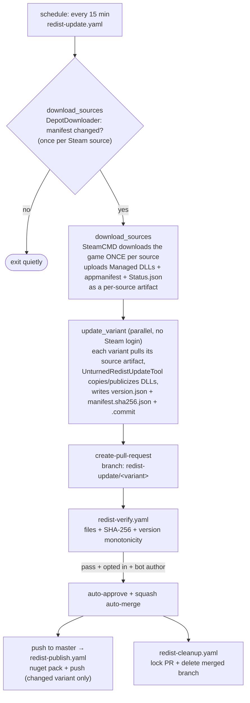

# Architecture

How the auto-updating redistribution works. Everything runs on GitHub Actions — there are no external servers.

> The image in the README (`architecture.jpg`, Jul 2025) is a high-level sketch and may lag behind the workflows. **This document is the source of truth.**

## TL;DR

A scheduled job polls Steam for new Unturned builds. When a build changes, it downloads the game, copies the managed DLLs into a per-variant folder under `redist/`, and opens a pull request. The PR is validated (files present, hashes match, version not a downgrade) and — if enabled — auto-approved and squash-merged. Merging to `master` triggers a pack-and-push of the affected NuGet package.


<details>
<summary>Same flow as a Mermaid diagram (click to expand)</summary>



</details>

## Workflows

| Workflow | Trigger | Responsibility |
| --- | --- | --- |
| `redist-update.yaml` | `schedule` (*/15) + `workflow_dispatch` | Probe each Steam **source** once (`download_sources`); on change, download the game once per source, then fan out to one PR per variant (`update_variant`, parallel, no extra Steam logins). Files an issue if a scheduled run fails. |
| `redist-verify.yaml` | `pull_request` to `master` touching `redist/**` | Validate the PR: required files present, SHA-256 hashes match `manifest.sha256.json`, version is not a downgrade. Auto-approve + enable squash auto-merge for the bot's PRs when `ALLOW_AUTO_MERGE_REDIST_PR` is `true`. |
| `redist-publish.yaml` | `push` to `master` touching `redist/redist-*/**` + `workflow_dispatch` | For each variant whose directory changed in the push, `nuget pack` the `.nuspec` and push to nuget.org. |
| `redist-cleanup.yaml` | `pull_request: closed` | Lock the PR conversation; delete the branch **only if merged**. |

External tool: [`RocketModFix/UnturnedRedistUpdateTool`](https://github.com/RocketModFix/UnturnedRedistUpdateTool) (net10). CLI: `dotnet UnturnedRedistUpdateTool.dll <unturned_path> <redist_dir> <app_id> [--force] [--preview] [-publicize <csv>] -update-files <csv>`. It copies (and optionally publicizes) the requested DLLs into `<redist_dir>`, and writes `version.json` (or `version.preview.json` with `--preview`), `manifest.sha256.json`, the `.nuspec` `<version>`, and a one-line `.commit` message.

## Single source of truth: `.github/variants.json`

Every variant is defined **once**, in `.github/variants.json`. All three matrix workflows load it via `jq` + `fromJson`. Each entry:

```json
{
  "variant": "client-preview",
  "appId": "304930", "depotId": "304931",
  "branch": "preview",
  "dir": "redist/redist-client-preview",
  "nuspec": "redist/redist-client-preview/RocketModFix.Unturned.Redist.Client.nuspec",
  "preview": true,
  "publicize": false,
  "anonymous": false,
  "loginId": 10003
}
```

- `branch`: `""` = Steam default branch, `"preview"` = Steam `preview` beta branch.
- `preview`: `true` only for the two variants that publish an `-preview<build>` **prerelease** (passes `--preview` to the tool → writes `version.preview.json`).
- `publicize`: `true` for the publicized variants (passes `-publicize Assembly-CSharp.dll`).
- `anonymous`: `true` = download with Steam anonymous login (no credentials); `false` = use the account in `STEAM_USERNAME`/`STEAM_PASSWORD`. The **server** build downloads anonymously (the anonymous account has the dedicated-server subscription); the **client** app's depot is *not* available anonymously, so client variants require the account.
- `loginId`: a unique 32-bit integer per variant, passed to DepotDownloader as `-loginid` so the per-source manifest probes can run concurrently on one account (see below).

### Steam logins: download once per source

The 10 variants share only **4 distinct Steam sources** (2 apps × 2 branches), and Steam allows just one session per account per *LoginID* (concurrent same-account logins fail with `AlreadyLoggedInElsewhere`). So `redist-update.yaml` is split into two jobs and **all Steam logins are confined to the first**:

1. **`download_sources`** (one job per source) does the only Steam work. It probes the manifest once and, on change, downloads the game once via `steamcmd` and uploads just the bits the tool needs (Managed DLLs + `appmanifest_<appid>.acf` + `Status.json`) as a `source-<appId>-<branch>` artifact. Anonymous **server** sources each get a unique `concurrency` group → fully parallel. The two authenticated **client** sources share one group → serialized; with only two members, a concurrency group keeps one running + one pending and **never cancels** (the 3+ case GitHub *does* cancel cannot occur). DepotDownloader probes still use a unique `loginId` per source.
2. **`update_variant`** (one job per variant, **fully parallel**) never logs into Steam: each variant downloads its source's artifact, runs the tool, records the manifest id, and opens its rolling PR. The artifact's presence is the "source changed" signal (listed via the run-artifacts API, hence the job's `actions: read`). No account, no contention, nothing to serialize.

This replaced an earlier per-variant matrix that forced `max-parallel: 1` and had every variant re-download the whole game — 10 serial downloads instead of today's 4 (mostly parallel).

## The 4 sources → 10 directories → 6 packages

The 10 redist directories pull from only **4 distinct Steam sources** (2 apps × 2 branches) and publish to **6 NuGet package ids**:

| Variant directory | Steam source (app / branch) | NuGet package id | Version style |
| --- | --- | --- | --- |
| `redist/redist-client` | 304930 / default | `…Redist.Client` | stable `X.Y.Z.N` |
| `redist/redist-client-preview` | 304930 / preview | `…Redist.Client` | prerelease `X.Y.Z.N-preview<build>` |
| `redist/redist-client-preview-old` | 304930 / preview | `…Redist.Client-Preview` *(legacy)* | stable-style `X.Y.Z.N` |
| `redist/redist-client-publicized` | 304930 / default | `…Redist.Client.Publicized` | stable `X.Y.Z.N` |
| `redist/redist-client-preview-publicized` | 304930 / preview | `…Redist.Client.Publicized` | stable-style `X.Y.Z.N` |
| `redist/redist-server` | 1110390 / default | `…Redist.Server` | stable `X.Y.Z.N` |
| `redist/redist-server-preview` | 1110390 / preview | `…Redist.Server` | prerelease `X.Y.Z.N-preview<build>` |
| `redist/redist-server-preview-old` | 1110390 / preview | `…Redist.Server-Preview` *(legacy)* | stable-style `X.Y.Z.N` |
| `redist/redist-server-publicized` | 1110390 / default | `…Redist.Server.Publicized` | stable `X.Y.Z.N` |
| `redist/redist-server-preview-publicized` | 1110390 / preview | `…Redist.Server.Publicized` | stable-style `X.Y.Z.N` |

Notes:
- The main **`Client` / `Server`** packages receive both a *stable* version (default branch) and a *prerelease* version (preview branch). Consumers who opt into prereleases of `…Redist.Client` get the preview build under the same package id.
- The **`*.Publicized`** packages similarly receive both default-branch and preview-branch builds (the preview one as a higher stable-style version).
- The **`*-Preview`** package ids are *legacy*, fed only by the `*-preview-old` variants. They are kept for **backward compatibility** with consumers that referenced the old standalone preview packages, from before preview builds were folded into the main package ids as prereleases.

### Legacy artifacts (kept on purpose)

- **`version.preview.json` inside the stable `redist-client` / `redist-server` directories** is an orphaned tracker left over from an earlier "preview embedded in stable" scheme. It is no longer updated (frozen at an old version) and is intentionally retained; the active preview metadata lives in the `redist-*-preview` directories.
- The **`*-preview-old`** variants and the legacy `*-Preview` package ids are retained for backward compatibility, not removed.

### Why the build id, not the version (rollback safety)

`Verify` checks that an update is a **newer upstream build before auto-merging**, gating on the Steam **`BuildId`** (from `version.json`), *not* the game version string. Reason: SDG occasionally rolls back a release — on the stable branch they ship the revert as a higher patch number, but on the **preview branch the game version can dip** while the content is reverted. Steam build ids, however, are monotonic per app+branch and **increase even on a rollback** (a rollback is a new, higher-numbered build). So:

- **`BuildId` decreased** → we somehow processed an *older* build than what's published → hard fail (a real regression).
- **`BuildId` increased but the NuGet version dipped** → a legitimate upstream rollback → allowed, emitted as a warning (not a block).

This lets the redist faithfully follow upstream rollbacks instead of getting stuck.

## How to add a new variant

1. Create the redist directory and its `.nuspec` under `redist/` (matching the existing layout).
2. Add **one object** to `.github/variants.json` with all fields (`variant`, `appId`, `depotId`, `branch`, `dir`, `nuspec`, `preview`, `publicize`, `anonymous`, `loginId`). Give it a `loginId` not used by any other variant.

That's it — `redist-update`, `redist-publish`, and `redist-verify` all derive their matrices from that file. (The `workflow_dispatch` `variant` input is a free-form string validated against `variants.json`, so no dropdown to update.)

## Conventions

- **Third-party actions are pinned to full commit SHAs** (with a `# vX` comment) to prevent tag-retargeting supply-chain attacks; Dependabot keeps them current. First-party `actions/*` may use major tags.
- **Secrets** (`STEAM_USERNAME`, `STEAM_PASSWORD`, `NUGET_DEPLOY_KEY`) are passed via step `env:`, never as inline command-line arguments.
- **Failures are not swallowed.** A failed variant turns the run red; scheduled failures open/update a GitHub issue labelled `update-failure`.
- Publishing **fails on a duplicate version by design** (no `--skip-duplicate`) — a repeated version signals an upstream problem.
