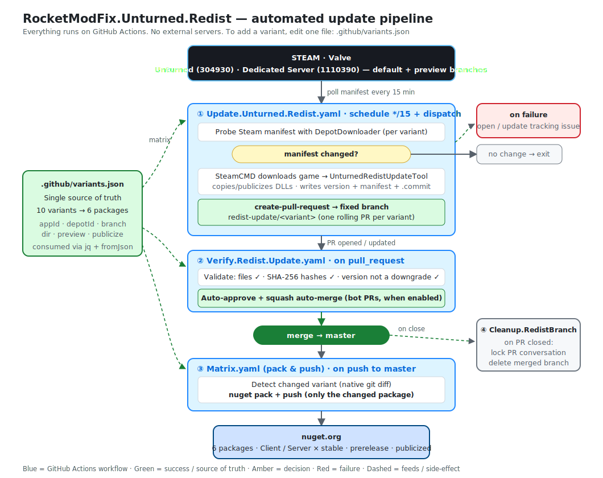

# RocketModFix.Unturned.Redist

Unturned's managed assemblies (`Assembly-CSharp.dll`, `com.rlabrecque.steamworks.net.dll`, `UnturnedDat.dll`, the SDG/Unity dependencies, and the API XML docs), packaged for NuGet and refreshed automatically each time Unturned ships a new build. Reference a package instead of hand-copying DLLs out of the game's `Managed` folder after every patch.

> **Redistributed with permission.** Nelson Sexton (Smartly Dressed Games) gave explicit written approval to distribute Unturned's libraries — see [issue #8](https://github.com/RocketModFix/RocketModFix.Unturned.Redist/issues/8).

## Install

```bash
dotnet add package RocketModFix.Unturned.Redist.Server
```

or in your `.csproj`:

```xml
<PackageReference Include="RocketModFix.Unturned.Redist.Server" Version="x.y.z" />
```

## Which package do I want?

Choose by **side** (client or server). Use a **`.Publicized`** variant when your plugin needs to touch private/internal members — their visibility is rewritten to public.

| Package | For |
| --- | --- |
| [](https://www.nuget.org/packages/RocketModFix.Unturned.Redist.Client) | Client-side tools and mods |
| [](https://www.nuget.org/packages/RocketModFix.Unturned.Redist.Server) | Server-side plugins and tools |
| [](https://www.nuget.org/packages/RocketModFix.Unturned.Redist.Client.Publicized) | Client mods that need non-public members |
| [](https://www.nuget.org/packages/RocketModFix.Unturned.Redist.Server.Publicized) | Server plugins that need non-public members |

### Using a `.Publicized` package

Add `AllowUnsafeBlocks` to your plugin's `.csproj`:

```xml
<PropertyGroup>
  <AllowUnsafeBlocks>true</AllowUnsafeBlocks>
</PropertyGroup>
```

The publicized DLL is a **compile-time reference only**. At runtime your plugin loads inside Unturned, which has its own original `Assembly-CSharp.dll` where those members are still private. Unturned runs on Mono, and `AllowUnsafeBlocks` is what lets the Mono runtime skip the access check for them. Without it you'll hit runtime errors like:

```
Field `SDG.Unturned.Provider:isDedicatedUGCInstalled' is inaccessible from method ...
```

`virtual`/`abstract` members are intentionally **not** publicized — they keep their original accessibility, so you can still override them normally (e.g. `protected override void execute(...)` on a `Command`). Publicizing them would force the override to be `public`, which the compiler rejects with *"cannot change access rights"*.

### Stable vs. preview builds

`Client` and `Server` carry two streams under the **same package id**:

- **Stable** — Unturned's default branch, versioned `x.y.z.n`.
- **Preview** — Unturned's `preview` branch, published as a prerelease `x.y.z.n-preview<build>`. Enable "include prerelease" in your NuGet client to pull it.

The standalone [`…Client-Preview`](https://www.nuget.org/packages/RocketModFix.Unturned.Redist.Client-Preview) and [`…Server-Preview`](https://www.nuget.org/packages/RocketModFix.Unturned.Redist.Server-Preview) packages are **legacy**. They still update for projects that already reference them, but new code should use the prerelease stream above.

## Example plugin

[**RocketModFix.Unturned.Redist.Example**](https://github.com/RocketModFix/RocketModFix.Unturned.Redist.Example) is a small, runnable RocketMod plugin showing how to consume these packages in practice — including a side-by-side comparison of reading a non-public member via **reflection** (the plain redist) vs. a **`.Publicized`** package (a plain, compile-checked field access), plus how to drop the built DLL on a server and confirm it loads.

## How it works

Everything runs on GitHub Actions, with no external servers. A scheduled job watches Steam for new Unturned builds; when one lands it downloads the build, repackages the managed DLLs, and opens a pull request. The PR is validated (files present, hashes match, version not a downgrade) and auto-merged, which publishes the affected package to NuGet.

📖 **[ARCHITECTURE.md](ARCHITECTURE.md)** has the full picture: the workflows, the variant matrix in [`.github/variants.json`](.github/variants.json), how the 4 Steam sources map to 10 directories and 6 packages, and how to add a variant.



## Credits

- [Unturned-Datamining](https://github.com/Unturned-Datamining)
- [setup-steamcmd](https://github.com/CyberAndrii/setup-steamcmd)
